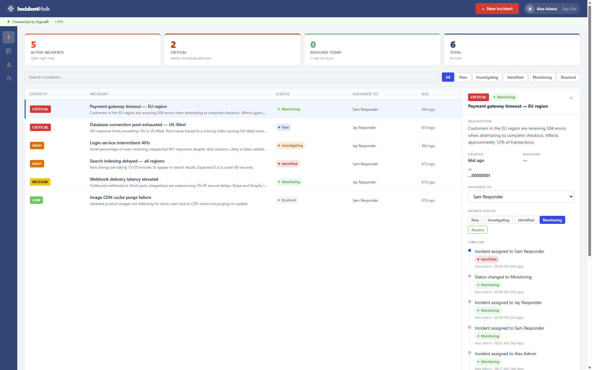
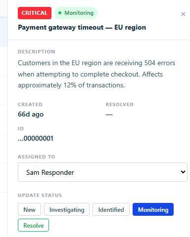
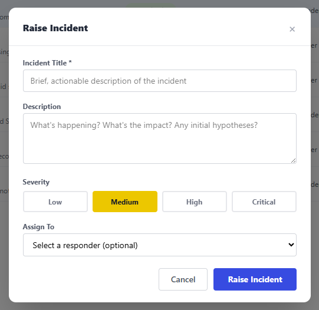
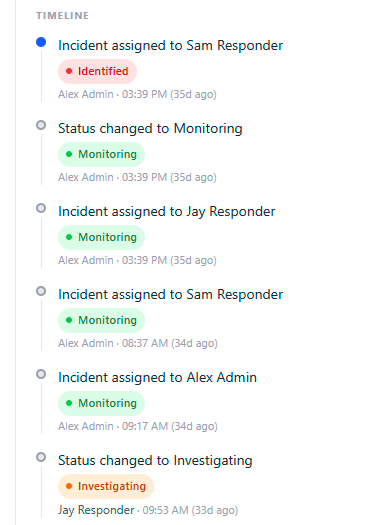
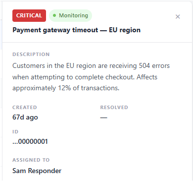
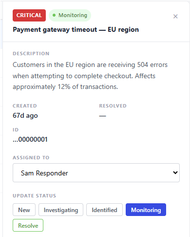
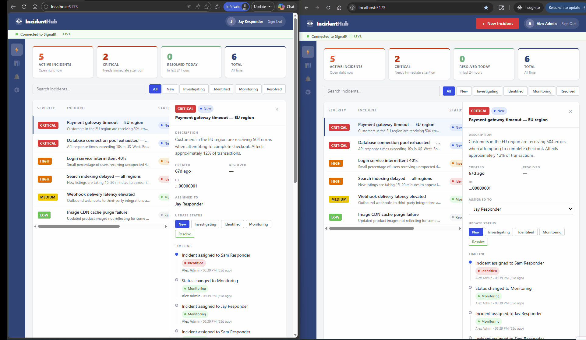

# IncidentHub

A real-time incident management system built with .NET, React, and SignalR.

## 🚀 Features

- Real-time incident tracking with SignalR
- Role-based access control (Admin, Responder, Viewer)
- Incident lifecycle management (New → Investigating → Identified → Monitoring → Resolved)
- Assignment tracking with user management
- Timeline history for all incident changes
- Responsive web interface

## 📸 Screenshots

### Incident Dashboard
<p align="center">
  
</p>

The dashboard provides a view of all incidents with filtering by status or searchable title and description. Incidents are ordered by severity.

---

### Incident Detail View
<p align="center">
  
</p>

Each incident displays full details including description, severity, current status, assigned responder, and a complete timeline of all status changes and updates.

---

### Create New Incident
<p align="center">
  
</p>

Creating an incident is straightforward — provide a title, description, severity level and optional assigned responder. The incident is automatically assigned a "New" status and tracked to the creator.

---

### Incident Timeline
<p align="center">
  
</p>

A full audit trail is maintained for every incident. Each status change, assignment, and resolution is recorded with the user who made the change and when.

---

### Role-Based Access Control
<p align="center">
  <strong>Viewer</strong> — Read-only access<br/>
  <br/>
  <br/><br/>
  &nbsp;&nbsp;
  <strong>Admin</strong> — Full management capabilities<br/>
  <br/>
  
</p>

IncidentHub enforces fine-grained permissions. Viewers can read incidents, responders can update, and admins have full management capabilities.

---

### Real-Time Updates
<p align="center">
  
</p>

Incident changes are broadcast in real-time to all connected users via SignalR, ensuring the dashboard stays current without manual refreshes.

## 🏗️ Architecture

- **Frontend**: React 19 with TypeScript
- **Backend**: .NET 10 Minimal API with CQRS pattern
- **Real-time**: SignalR for live updates
- **Authentication**: Auth0 integration
- **Database**: SQL Server
- **State Management**: React Query + TanStack Query

## 📦 Key Components

### Backend
- MediatR for CQRS implementation
- FluentValidation for request validation
- Entity Framework Core for data access
- Clean architecture with separate features

### Frontend
- Custom UI components (Severity badges, Status indicators)
- Real-time connection status monitoring
- User assignment dropdown with role-based filtering
- Toast notifications for user feedback

## 🔧 Getting Started

### Prerequisites
- .NET 10 SDK
- Node.js 18+
- SQL Server
- Auth0 account

### Configuration
Create `appsettings.development.json` with the following structure:
```json
{
  "ConnectionStrings": {
    "DefaultConnection": "Server=localhost;Database=IncidentHub;Trusted_Connection=true;TrustServerCertificate=true;"
  },
  "Auth0": {
    "Domain": "your-domain.auth0.com",
    "Audience": "your-api-identifier",
    "ClientId": "your-auth0-management-application-client-id",
    "ClientSecret": "your-auth0-management-application-client-secret"
  },
  "TestUser": {
    "DefaultPermissionSet": "admin"
  }
}
```

### Backend Setup
1. Clone the repository
2. Configure appsettings.json with your Auth0 and database settings
3. Run `dotnet restore` and `dotnet run`

### Frontend Setup
1. Navigate to client directory
2. Run `npm install`
3. Run `npm run dev`

## 📊 Sample Data
Development environment includes 6 pre-populated sample incidents with complete timeline histories for testing all features.

## 🔐 Auth0 Setup

### Applications
- **Regular Web Application** for your frontend
- **Machine-to-Machine Application** for backend Auth0 API access to user data

### Roles & Permissions
- **Admin**: `read:incidents`, `create:incidents`, `manage:incidents`, `assign:incidents`, `read:users`
- **Responder**: `read:incidents`, `manage:incidents`, `read:users`
- **Viewer**: `read:incidents`, `read:users`

### Authorization Model
All roles require `read:users` permission to access user information endpoints. This ensures consistent access to responder names and assignment features across all user roles.

### API Configuration
1. Create an API in Auth0 with identifier matching your `Auth0:Audience`
2. Enable RBAC and Add Permissions in the Access Token
3. Create roles and assign permissions
4. Assign users to roles

### Test Users
Use `X-Permissions` header in development for role simulation

## 🛠️ Development

### Key Commands
```bash
# Backend
dotnet watch run

# Frontend
npm run dev
```
### URL
`http://localhost:5173`

## 📚 API Documentation
API documentation available via Scalar at `https://localhost:7125/scalar/v1`

## 🧪 Testing

### Unit Tests
Comprehensive unit tests covering:
- Command handlers (Create, Assign, Resolve, Update Status)
- Query handlers (Get Incidents, Get Incident by ID)
- Validation logic
- Business rule enforcement

### Integration Tests
- Full API endpoint testing
- Authentication/Authorization validation
- End-to-end workflow testing

### Test Architecture
- **In-memory database** for fast unit tests
- **TestUserMiddleware** integration for authorization testing
- **Mock services** for isolation
- **FluentAssertions** for readable test assertions
- **xUnit** as the testing framework
- **Moq** for mocking dependencies
- **Entity Framework Core In-Memory** for database testing

### Running Tests

```bash
# Run all tests
dotnet test

# Run tests with code coverage
dotnet test --collect:"XPlat Code Coverage"

# Run specific test category
dotnet test --filter "Category=Unit"
```

## License

This project is licensed under the MIT License. See [LICENSE](LICENSE) for details.


